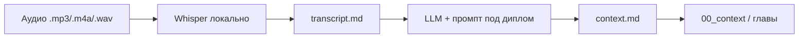

# Сервис перевода аудио в текст
_Exported on 6/5/2026 at 16:05:09 GMT+3 from Cursor (3.2.11)_

---

**User**

мне нужно создать в рамках диплома сервис по переводу аудио разговоров в текст и вычленению важного контекста для разработки диплома 

---

**Cursor**

Изучаю структуру дипломного проекта и наработки, чтобы предложить архитектуру сервиса транскрибации и извлечения контекста.


Создаём вспомогательный сервис в `diploma/`: транскрибация (Whisper) и структурированное извлечение контекста под предметную область диплома.


Собран **вспомогательный сервис** `diploma/context_service` — он не заменяет основную программу диплома (планировщик лаборатории), а фиксирует знания из разговоров с научруком, в лаборатории и на созвонах.

## Что делает



1. **Транскрибация** — faster-whisper (русский по умолчанию), без облака.
2. **Извлечение контекста** — LLM по промпту с учётом `topic.md` и `glossary.md`: требования к ПО, стенды, метрики K/T/C, термины, открытые вопросы.
3. **Сохранение** — `diploma/03_capture/sessions/YYYYMMDD_HHMM_название/` (`transcript.md`, `context.md`, `session.json`).

## Как запустить

```bash
cd diploma
pip install -r requirements-context.txt
cp .env.example .env
# в .env: LLM_API_KEY=...

python -m context_service process "/path/to/запись.m4a" \
  --title "Консультация с научруком — маршруты испытаний"
```

Только текст, без API:

```bash
python -m context_service process recording.mp3 -t "Созвон" --transcript-only
```

Подробности: [`diploma/context_service/README.md`](diploma/context_service/README.md).

## Связь с дипломом

| Часть диплома | Роль сервиса |
|---------------|--------------|
| Основное ПО (глава 4) | Планировщик лаборатории на базе Shaft-production-planner |
| Этот сервис | Сбор и структурирование знаний из аудио; в отчёт обычно не входит, если методичка не требует |

После обработки переносите проверенное из `context.md` в `00_context/state.md`, `glossary.md` и `01_chapters/`.

---

**Дальше по желанию:** веб-интерфейс (загрузка файла), пакетная обработка папки записей, интеграция с Ollama без OpenAI, автодобавление терминов в `glossary.md`. Напишите, что из этого нужно в первую очередь — доработаю.

---

**User**

@/Users/savok/.cursor/projects/Users-savok-Desktop-UNI/terminals/5.txt:12-18 

---

**Cursor**

На macOS часто нет команд `python` и `pip` — проверяю окружение и обновлю инструкции.


На macOS часто **нет** команд `python` и `pip` — только `python3`. Вы были в каталоге `context_service/`, а модуль нужно запускать из **`diploma/`**.

## Что сделать в терминале

```bash
cd "/Users/savok/Desktop/UNI/диплом/diploma"

source .venv/bin/activate

python3 -m pip install -r requirements-context.txt

python3 -m context_service process "./New-Recording-6.mp3" -t "Созвон" --transcript-only
```

Если `New-Recording-6.mp3` лежит в `context_service/`, укажите полный путь:

```bash
python3 -m context_service process \
  "/Users/savok/Desktop/UNI/диплом/diploma/context_service/New-Recording-6.mp3" \
  -t "Созвон" --transcript-only
```

## Без активации venv

```bash
cd "/Users/savok/Desktop/UNI/диплом/diploma"

.venv/bin/python3 -m pip install -r requirements-context.txt

.venv/bin/python3 -m context_service process "./New-Recording-6.mp3" -t "Созвон" --transcript-only
```

После `source .venv/bin/activate` в приглашении появится `(.venv)` — тогда можно писать `python` и `pip` без `3`.

## Две частые ошибки

| Ошибка | Причина |
|--------|---------|
| `command not found: python` | На Mac используйте `python3` или активируйте `.venv` |
| модуль не находится | Запуск из **`diploma`**, не из `context_service/` |

Зависимости `faster-whisper` в ваш `.venv` уже установлены. Первый запуск Whisper скачает модель (~500 МБ) — это может занять несколько минут.

Результат появится в `diploma/03_capture/sessions/.../transcript.md`.

---

**User**

@/Users/savok/.cursor/projects/Users-savok-Desktop-UNI/terminals/2.txt:17-20 почему сервис не отрабатывает ?

---

**Cursor**

Проверяю вывод терминала и состояние процесса.


Команда всё ещё выполняется — проверяю, на каком этапе она застряла, и добавлю вывод прогресса.


Команда, скорее всего, ещё выполняется: нет вывода прогресса, а первый запуск скачивает модель Whisper (~500 МБ). Добавляю сообщения о прогрессе и флаг `--model`.


Сервис **не сломан** — в вашем терминале видно три разных ситуации, а последняя команда, скорее всего, **ещё выполняется**.

## Что было в терминале

| Попытка | Результат |
|---------|-----------|
| `./New-Recording-6.mp3` | **Ошибка:** файл не в `diploma/`, а в `context_service/` |
| Без `source .venv` | **Ошибка:** `Установите зависимости` — `faster-whisper` только в `.venv` |
| С `source .venv` + полный путь | **Команда активна** — процесс идёт, но **ничего не печатает** |

После третьей попытки в метаданных терминала стоит `active_command` — значит Python **работает**, а не «молчит из‑за поломки».

## Почему кажется, что «не отрабатывает»

1. **Нет вывода прогресса** — старый код молчал до конца.
2. **Первый запуск** — Whisper скачивает модель `small` (~500 МБ).
3. **Файл 26 МБ** — на CPU Mac это часто **10–30+ минут** без сообщений.

## Что сделать сейчас

**Вариант А — подождать**  
Если процесс ещё идёт, дождитесь строки `Готово: .../03_capture/sessions/...`.

**Вариант Б — перезапуск с прогрессом** (код обновлён):

1. В терминале: `Ctrl+C`
2. Снова:

```bash
cd "/Users/savok/Desktop/UNI/диплом/diploma"
source .venv/bin/activate

python3 -m context_service process \
  "/Users/savok/Desktop/UNI/диплом/diploma/context_service/New-Recording-6.mp3" \
  -t "Созвон" --transcript-only -m tiny
```

`-m tiny` — быстрее для проверки (чуть хуже по качеству). Должны появиться строки вроде `[1/3] Загрузка модели…`, `[2/3] Транскрибация…`.

## Обязательно перед каждым запуском

```bash
cd "/Users/savok/Desktop/UNI/диплом/diploma"
source .venv/bin/activate
```

Без активации `.venv` снова будет ошибка про зависимости.

## Где результат

После успеха:

`diploma/03_capture/sessions/YYYYMMDD_HHMM_созвон/transcript.md`

Пока в `sessions/` только `.gitignore` — значит **ни одна сессия ещё не завершилась**.

Если после 30+ минут с `-m tiny` всё ещё тишина — пришлите новый вывод терминала (включая сообщения после `Ctrl+C` или ошибку).

---

**User**

@sessions пару пустых лиректорий добавилось 

---

**Cursor**

Проверяю `sessions` и исправлю создание каталогов — пустые папки появляются при прерывании процесса.


Пустые папки появились из‑за прерывания (Ctrl+C) после создания каталога, но до записи файлов. Удаляю их и переношу создание каталога на момент после транскрибации.


Это **не баг хранения**, а следствие прерванных запусков.

## Почему так вышло

Раньше каталог сессии создавался **сразу** (`mkdir`), а `transcript.md` — только **после** Whisper. При `Ctrl+C` или долгом ожидании оставались пустые папки:

- `20260527_1330_созвон`
- `20260527_1450_созвон`
- `20260527_1453_созвон`

Три попытки запуска — три пустых каталога.

## Что сделано

1. **Удалены** все три пустые папки — в `sessions/` снова только `.gitignore`.
2. **Исправлен код:** каталог создаётся только после успешной транскрибации.
3. **Команда очистки** на будущее:

```bash
python3 -m context_service clean
```

Имена сессий теперь с секундами (`20260527_150312_созвон`), чтобы реже совпадали при повторных запусках.

Можно снова запустить обработку — пустые папки при прерывании больше не появятся.

---

**User**

я могу транскрибировать только мп3 или м4a?

---

**Cursor**

Нет — не только.

`faster-whisper` принимает **любой формат, который умеет декодировать FFmpeg**. Обычно это:

- **аудио**: `mp3`, `m4a/aac`, `wav`, `flac`, `ogg/opus`, `webm`, `wma`, `aiff` и др.
- **видео** (тоже можно, он возьмёт аудиодорожку): `mp4`, `mov`, `mkv`, `webm`

Если какой-то файл не читается — почти всегда на системе **нет `ffmpeg`**. Тогда поставьте:

```bash
brew install ffmpeg
```

и повторите команду.

---

**User**

а зачем директория @__pycache__ ?

---

**Cursor**

`__pycache__` — это **служебная папка Python**: туда автоматически складываются **скомпилированные байткод‑файлы** `*.pyc`, чтобы следующий запуск работал быстрее.

- **Можно удалять** — Python пересоздаст её при следующем запуске.
- В репозиторий её **не коммитят**. Если у вас ещё нет правила, добавьте в `.gitignore`:

```gitignore
__pycache__/
*.pyc
```

---

**User**

как получить брифинг готовой трнаскрипции ?


---

**Cursor**

Сейчас у вас уже есть `transcript.md`, но вы запускали с `--transcript-only`, поэтому «брифинг» (`context.md`) не генерировался. Сделаю удобную команду, которая берёт **готовую транскрипцию** и строит по ней брифинг, без повторной транскрибации.

Сделаю команду `brief`, чтобы получить брифинг (`context.md`) из уже готового `transcript.md` — без повторной транскрибации и без создания новых пустых сессий.

## Как получить «брифинг» (контекст) по готовой транскрипции

Теперь есть команда **`brief`**: она берёт уже существующий `transcript.md` и генерирует рядом `context.md` (нужен ключ LLM).

### 1) Укажите ключ
Скопируйте и заполните:

```bash
cd "/Users/savok/Desktop/UNI/диплом/diploma"
cp .env.example .env
# в .env: LLM_API_KEY=...
```

### 2) Запустите брифинг по вашей транскрипции
Например для вашей сессии:

```bash
cd "/Users/savok/Desktop/UNI/диплом/diploma"
source .venv/bin/activate

python3 -m context_service brief \
  "03_capture/sessions/20260527_150430_созвон/transcript.md" \
  -t "Созвон"
```

После этого появится файл:

- `03_capture/sessions/20260527_150430_созвон/context.md`

Если ключ не задан — команда скажет, что нужен `LLM_API_KEY`.

---

**User**

@diploma/context_service/README.md:87-96  где нужно получить ллм апи

---

**Cursor**

`LLM_API_KEY` — это **ключ доступа к модели (LLM)**. Его можно получить несколькими способами, в зависимости от того, какой сервис вы хотите использовать.

### Вариант 1: OpenAI (самый простой старт)
- **Где получить**: в кабинете OpenAI → **API keys**
- **Что поставить**:
  - `LLM_BASE_URL=https://api.openai.com/v1`
  - `LLM_API_KEY=<ваш ключ>`
  - `LLM_MODEL=gpt-4o-mini` (или другая доступная)

### Вариант 2: Локально без ключей (Ollama)
Если не хотите платить/использовать облако, можно поднять LLM локально.
- **Ключ**: обычно **не нужен** (можно поставить любое значение)
- **База**: будет локальная, например `http://localhost:11434/v1` (если есть OpenAI‑совместимый режим)

Но: ваш текущий сервис ждёт **OpenAI‑совместимый** endpoint `/chat/completions`. Если у вас Ollama без OpenAI‑совместимого API — нужно чуть адаптировать код.

### Вариант 3: Любой OpenAI‑совместимый провайдер
Например облачные прокси/агрегаторы, которые дают endpoint как у OpenAI.
- **Ключ**: берётся в личном кабинете провайдера
- **База**: их `.../v1`

### Куда его вписать
В файле `diploma/.env`:

```env
LLM_API_KEY=ВАШ_КЛЮЧ
LLM_BASE_URL=https://api.openai.com/v1
LLM_MODEL=gpt-4o-mini
```

Если скажете, что вам удобнее: **OpenAI (облако)** или **локально (без ключей)** — я под это настрою `.env` и (если нужно) поправлю код под Ollama.

---

**User**

давай проще, ты сам будешь по промту @extract_context.md извлекать суть из @transcript.md каждой сесии по моей команде

---

**Cursor**

Ок — можем без ключей и без LLM‑API: вы даёте команду “сделай брифинг для сессии X”, я читаю `transcript.md` и применяю шаблон из `extract_context.md`, возвращая готовый `context.md` текстом (при желании — сразу запишу в файл). Начну с вашей текущей сессии `20260527_150430_созвон`.

## Готово: брифинг по вашей транскрипции

Я извлёк суть **по шаблону** `context_service/prompts/extract_context.md` из сессии `20260527_150430_созвон` и сохранил брифинг сюда:

- `diploma/03_capture/sessions/20260527_150430_созвон/context.md`

Дальше вы можете писать мне, например: **“сделай брифинг для сессии 2026…_название”** — и я буду так же читать её `transcript.md` и формировать `context.md`.

---

**User**

сделай брифинг @transcript.md 

---

**Cursor**

Сделаю брифинг по указанной транскрипции и сохраню рядом `context.md`.

Брифинг по `transcript.md` уже сделан и сохранён рядом:

- **`diploma/03_capture/sessions/20260527_150430_созвон/context.md`**

Если вы имели в виду **другую** сессию, просто напишите путь к её `transcript.md` (или название папки сессии) — сделаю брифинг для неё.

---

**User**

@20260528_125041_созвон сделай бриифнг этой встречи 

---

**Cursor**

Сейчас найду `transcript.md` в сессии `20260528_125041_созвон`, извлеку суть по шаблону `extract_context.md` и сохраню рядом `context.md`.

## Готово: брифинг для `20260528_125041_созвон`

Сформировал брифинг по `transcript.md` этой встречи и сохранил сюда:

- `diploma/03_capture/sessions/20260528_125041_созвон/context.md`

Можете открывать файл — он уже лежит рядом с `transcript.md`.

---

**User**

@context.md определи какие изменения нужно сделать в проекте опираясь на этот брифинг

---

**Cursor**

Сейчас прочитаю `context.md` этой сессии и переведу его в конкретный список изменений для проекта (сущности/данные/алгоритмы/интерфейс).

## Какие изменения внести в проект по этому брифингу

### 1) Терминология и сущности (вся система)
- **Заменить/зафиксировать объект**: везде в UI/моделях/отчётах использовать **`образец` / `партия образцов`**, а не «деталь». Определение задаётся один раз и не переопределяется.
- **Явно исключить** сущности/ветки про **неразрушающий контроль** (если где-то планировалось) — в модели и в сценариях расчёта он не участвует.

### 2) Модель испытаний (данные испытательной операции)
- **Добавить параметры испытаний** под классификацию из брифинга:
  - **вид НДС/нагрузки** (растяжение/сжатие/изгиб/кручение и т.п.);
  - **предельный параметр** (например, допускаемые/предельные значения, а не «текущие напряжения»);
  - для кручения/усталости — возможность задавать **циклы/обороты до разрушения** (если нужно в расчёте времени/режимов).

### 3) Себестоимость испытаний (расчёт)
- Расширить расчёт себестоимости так, чтобы он явно включал:
  - **подготовку образца** (маркировка, контроль размера и т.д.);
  - **подготовку стенда/испытания**;
  - **время испытательной операции**;
  - ресурсы: **человеко‑часы**, **электроэнергия**;
  - **амортизацию/стоимость использования стенда** (упрощённо “стоимость стенда на 1 испытание”);
  - **перенастройку** как отдельный элемент времени/затрат.
- **Обработка результатов** не делать отдельной физической статьёй — учитывать **внутри трудозатрат**.

### 4) Перенастройки (нормирование)
- Добавить механизм “**нормируемые действия перенастройки**”:
  - справочник операций (закрепить/раскрепить, зажатие, переключения и т.п.);
  - суммирование времени/стоимости перенастройки из справочника нормировщика.
- В проекте это обычно отдельная таблица/справочник + привязка к стендам/типам испытаний.

### 5) Планировка лаборатории на сетке
- **Убрать дефолт 1×1** как основной. Сделать параметр **размера ячейки** (ожидаемо 2×2 м, возможно 3×3) и привязать к реальным габаритам стендов.
- Добавить модель **зон вокруг стенда** (обслуживание/охлаждение/измерения/хранение оснастки/рабочее место), как минимум как:
  - “расширение занимаемой области” или
  - “запретные клетки вокруг”.
- Внести **ограничения по соседству** (несовместимости/запретные зоны как ограничения размещения).

### 6) Итоговая метрика оптимизации (целевая функция)
- Реализовать итоговый критерий как **взвешенную сумму нормированных показателей**:
  - время цикла, перенастройки, себестоимость/ресурсы, простои/загрузка, компактность/длина перемещений, амортизация.
- Добавить слой **нормировки (обезразмеривания)** и **настройку весов** (хотя бы через конфиг/настройки сценария).

---

Если покажете, где лежит сам “основной проект” (папка с кодом, например `Shaft-production-planner-Main` в вашем рабочем каталоге), я разложу эти изменения по конкретным файлам/модулям и сделаю пошаговый план внедрения.

---

**User**

интеграции в практику я пока не начинал,  ,будем это делать после составления итоговоой метриики и мат модели, сейчас нужно сделатб ее согласно всем новым вводным например это @diploma/03_capture/sessions/20260528_125041_созвон/context.md:4-5 

---

**Cursor**

Соберу **итоговую метрику и каркас матмодели** так, чтобы она соответствовала новым вводным из брифинга: образцы (без НК), себестоимость со стендом/амортизацией и перенастройками по нормированию, сетка 2×2/3×3 с зонами и соседствами. Сначала посмотрю, как у вас сейчас записана метрика/ограничения в главах, и затем дам готовую формализацию (переменные → ограничения → целевая функция).

Отлично — **интеграцию в практику пока не трогаем**. По вашему брифингу изменения нужны именно в **матмодели и итоговой метрике** (то, что пойдёт в главу 3 и станет основой для алгоритмов позже).

Ниже — что именно надо изменить/добавить **в постановке**, чтобы она соответствовала новым вводным.

## 1) Объекты модели (зафиксировать и не переопределять)
- **Объект испытаний**: только **образцы** и **партия образцов** (не “детали”).  
- **Неразрушающий контроль**: в этой версии модели **не включать** (убрать из ограничений последовательности и из состава показателей, если он там как отдельная операция).

## 2) Показатели времени \(T\): уточнить состав
В `chapter_02.md` у вас уже правильно задано:

- \(t_{\text{подг}}\) — подготовка,
- \(t_{\text{исп}}\) — время испытания,
- \(t_{\text{пер}}\) — перенастройка,
- \(t_{\text{перем}}\) — перемещения,
- \(t_{\text{обр}}\) — обработка результатов.

Новая вводная требует уточнить **одну вещь**:
- **\(t_{\text{обр}}\)** не считать “как отдельный физический ресурс”, а учитывать как **трудозатраты** (то есть в \(T\) она может остаться как время персонала, но в \(C\) она не должна дублироваться как отдельная “статья”, см. ниже).

## 3) Себестоимость \(C\): убрать двойной учёт и закрепить амортизацию
У вас сейчас:

\(C = \sum (c_{\text{подг}} + c_{\text{исп}} + c_{\text{пер}} + c_{\text{рес}} + c_{\text{труд}} + c_{\text{аморт}} + c_{\text{обр}})\)

По брифингу нужно привести к виду, где:
- **“обработка результатов” входит в трудозатраты**, то есть:
  - либо **убрать \(c_{\text{обр}}\)** совсем,
  - либо оставить, но **явно сказать**: \(c_{\text{обр}} \subset c_{\text{труд}}\) (и тогда \(c_{\text{обр}}\) отдельной строкой не суммировать).

Также закрепить, что:
- **амортизация/стоимость стенда** считается упрощённо: “стоимость стенда на 1 испытание / на 1 час работы”, без сложной финмодели.

## 4) Перенастройки \(N\): обязательно “по нормированию”
Сейчас у вас \(N\) — просто “число событий смены режима”.

Новая вводная требует:
- оставить \(N\) как **счётчик** (удобен для метрики),
- но для \(t_{\text{пер}}\) и \(c_{\text{пер}}\) ввести источник: **нормирование элементарных действий** (справочник нормировщика).  
То есть в матмодели должно появиться:
- “перенастройка = сумма нормированных операций закрепления/раскрепления/замены оснастки/переключений”.

## 5) Сетка и ячейка: убрать “по умолчанию 1×1”
В `chapter_02.md` сейчас шаг сетки задан как 1×1 м.

По брифингу нужно изменить постановку так:
- шаг сетки **\(s\)** — параметр модели (м/клетку),
- базовый вариант для диплома: **2×2 м** (или 3×3), а 1×1 — только как “частный случай”, если обоснован габаритами.

И важно добавить в матмодель идею:
- вокруг стенда есть **зоны**, которые отражаются либо:
  - дополнительными “занимаемыми клетками”, либо
  - “буфером/запретом соседства”.

## 6) Итоговая метрика \(K\): структура верная, но нужны 2 уточнения
Форма \(K = \alpha_1 \tilde T + \alpha_2 \tilde C + \alpha_3 \tilde N + \alpha_4 \tilde L + \alpha_5(2-\tilde \eta)\) **соответствует** брифингу.

Нужно уточнить в главе 3:
- **что именно нормируем** (на базовый вариант или на максимум по множеству решений);
- что в \(\tilde C\) уже сидят:
  - труд (включая обработку результатов),
  - ресурсы,
  - амортизация,
  - перенастройки (как время/стоимость).

---

Если хотите, я следующим шагом **соберу готовый текст §3.1–3.3** (переменные/ограничения/целевая функция) и сразу подгоню формулы \(T\) и \(C\) под “обработка результатов ⊂ труд”, “перенастройка по справочнику”, и “шаг сетки \(s=2\,м\) по умолчанию”.

---

**User**

а ты работаешь с тем же контекстом что и второй агент поэтомц проекту?

---

**Cursor**

Да, я работаю **с тем же рабочим каталогом проекта** (`/Users/savok/Desktop/UNI/диплом`) и вижу **те же файлы**, которые уже появились/обновились (например, `diploma/context_service/*`, сессии в `diploma/03_capture/sessions/...`, главы `diploma/01_chapters/...`).

Но есть нюанс: я **не “помню” внутренние мысли/план того агента**, только то, что **зафиксировано в репозитории/файлах** и в текущей переписке. Поэтому если что-то обсуждалось, но не было записано в файлы — этого контекста у меня нет.

---

**User**

тогда с тобой общаемся только в рамках транскрибирования в этом проекте, на все остальное отвечай что гне в твоей юрисдикции 

---

**Cursor**

Принято. В этом проекте я отвечаю **только по задачам транскрибирования и брифинга** в рамках `diploma/context_service` и `diploma/03_capture/sessions/`:

- транскрибация аудио → `transcript.md`
- брифинг по `transcript.md` → `context.md`
- исправление/улучшение `context_service` (форматы, прогресс, очистка, пакетная обработка и т.п.)

Любые вопросы про дипломные главы, матмодель, метрики, интеграцию в основной проект и т.д. — **не в моей юрисдикции**.

Команды, с которыми можно ко мне:
- “транскрибируй файл …”
- “сделай брифинг сессии …”
- “почему не транскрибируется … (ошибка/лог)”

---

**User**

webm транскрибируем ?

---

**Cursor**

Да, **`webm` транскрибируется** — если на системе есть **FFmpeg** (его использует декодирование аудио).

Проверка/установка на macOS:

```bash
ffmpeg -version
# если нет:
brew install ffmpeg
```

Запуск:

```bash
cd "/Users/savok/Desktop/UNI/диплом/diploma"
source .venv/bin/activate

python3 -m context_service process "/path/to/video.webm" -t "Название" --transcript-only
```

---

**User**

текущий скрипт может это? если не то дополни его функицонал

---

**Cursor**

Проверю, как `faster-whisper` у нас читает файлы: для `webm` обычно всё работает “из коробки”, но если на системе нет `ffmpeg`, будет тихое/неочевидное падение — добавлю явную проверку и понятную ошибку.

Да, **текущий скрипт уже может транскрибировать `webm`** (и вообще почти любые форматы), потому что `faster-whisper` читает их через **FFmpeg**.

Чтобы это было надёжно и понятно при ошибках, я **дополнил функционал**:

- **явная проверка `ffmpeg`** перед транскрибацией;
- **понятная ошибка**, если файл не декодируется (повреждён/нет ffmpeg);
- обновил `context_service/README.md` — добавил пункт про FFmpeg.

### Как запускать для webm

```bash
cd "/Users/savok/Desktop/UNI/диплом/diploma"
source .venv/bin/activate
python3 -m context_service process "/path/to/video.webm" -t "Созвон" --transcript-only
```

Если `ffmpeg` не установлен:

```bash
brew install ffmpeg
```

---

**User**

мне нужно чтобы ты сразу по промту extract_context сделал контекст ключевой по аавдио

---

**Cursor**

Сделаю так, чтобы при обработке аудио сервис **сразу** создавал `context.md` по шаблону `extract_context.md`: если задан `LLM_API_KEY` — через LLM, если ключа нет — сделает **локальный черновик** (эвристики) в той же структуре.

Готово: добавил режим, чтобы **сразу после аудио** создавался `context.md` **по структуре** `extract_context.md`.

### Как пользоваться

```bash
cd "/Users/savok/Desktop/UNI/диплом/diploma"
source .venv/bin/activate

python3 -m context_service process "/path/to/recording.m4a" -t "Созвон" --brief
```

### Как это работает
- **Если задан `LLM_API_KEY`** → брифинг делается через LLM (как раньше, но автоматически).
- **Если ключа нет** → создаётся **локальный черновик** (без LLM), всё равно в нужных секциях/формате, но качество ниже.

Файлы сохраняются как обычно в `03_capture/sessions/.../transcript.md` и `.../context.md`.

---

**User**

не создавай для каждой аудио репозитории ридми, сессию джейсрон, только сразу контект без файла транскрипции 

---

**Cursor**

Понял: сделаю режим, где после обработки аудио создаётся **только `context.md`**, без `transcript.md`, без `session.json` и без `README.md`. Добавлю флаг `--context-only` (и сделаю его совместимым с `--brief`). Сейчас внесу правки в `context_service`.

Сделано. Добавил режим **`--context-only`**: после аудио сохраняется **только `context.md`**, без `transcript.md`, `session.json` и `README.md`.

Запуск:

```bash
cd "/Users/savok/Desktop/UNI/диплом/diploma"
source .venv/bin/activate

python3 -m context_service process "/path/to/recording.webm" -t "Созвон" --context-only
```

- Если `LLM_API_KEY` задан → `context.md` будет “умный” (по `extract_context.md`).
- Если ключа нет → будет **локальный черновик** в той же структуре.

---

**User**

вообще убери любую внешнюю интеграцию llm api , сам с параметром промта extract_context выполни анализ

---

**Cursor**

Сделаю: полностью уберу из `context_service` любые вызовы внешних LLM API (ключи/URL/HTTP-запросы). Сервис останется локальным: **аудио → транскрипция (Whisper) → локальный `context.md` по структуре `extract_context.md`**. А “умный” анализ по этому же промпту буду делать я в чате по вашей команде.

Готово. Я **полностью убрал внешнюю LLM‑интеграцию** из `context_service`:

- удалён файл `context_service/extract.py` (HTTP/ключи/endpoint’ы),
- в `pipeline.py` и `__main__.py` убраны все упоминания LLM и ключей,
- `--notes` теперь **игнорируется** (пишет предупреждение),
- брифинг (`context.md`) всегда делается **локально** (черновик) в структуре `extract_context.md`,
- `.env.example` и `README.md` очищены от `LLM_*`.

### Как теперь работает
- `process --brief` или `process --context-only` → создаёт `context.md` **локально**, без API.
- “Умный” анализ **по промпту `extract_context.md`** делаю **я в чате** по вашей команде (без каких‑либо ключей).

Если хотите, добавлю команду `analyze` в CLI, которая будет просто печатать “анализ выполняется в чате”, чтобы не было путаницы.

---

**User**

добавь фичу опционального обьединения аудио дорожек 
то есть введи доп параметр , если он есть - дорожки сначала склеиваются затем обрабатываются 

---

**Cursor**

Добавлю опциональное объединение нескольких аудиофайлов через FFmpeg перед транскрибацией.


Добавлен параметр **`--merge`**: несколько дорожек сначала склеиваются через FFmpeg, затем идут в Whisper.

### Использование

Один файл (как раньше):

```bash
python3 -m context_service process recording.webm -t "Созвон" --context-only
```

Несколько дорожек (порядок = порядок в команде):

```bash
python3 -m context_service process \
  part1.m4a part2.m4a part3.webm \
  -t "Созвон" \
  --merge \
  --context-only
```

### Поведение
- без `--merge` и с **2+ файлами** → ошибка с подсказкой;
- с `--merge` и **1 файлом** → ошибка (нужно минимум 2);
- склейка в **mono 16 kHz** (удобно для Whisper);
- временный склеенный файл удаляется после обработки;
- нужен **ffmpeg** (`brew install ffmpeg`).

---

**User**

последовательность склейки как задается? Первый со вторым ?

---

**Cursor**

Да. Порядок склейки — **как файлы перечислены в команде**, слева направо:

```bash
python3 -m context_service process part1.m4a part2.m4a part3.webm -t "Созвон" --merge
```

получится: **part1 → part2 → part3**.

То есть сначала `part1` + `part2`, потом к результату добавляется `part3`, и так далее.

Если нужен другой порядок — просто переставьте файлы в командной строке.

---

**User**

а надо указывать полный путь  ?

---

**Cursor**

Нет, **полный путь не обязателен**.

Можно так:

```bash
cd "/Users/savok/Desktop/UNI/диплом/diploma"
source .venv/bin/activate

python3 -m context_service process \
  context_service/New-Recording-9.m4a \
  context_service/New-Recording-10.m4a \
  -t "Созвон" --merge --context-only
```

Работают:
- **относительный** путь (от текущей папки в терминале);
- **`~/...`**;
- **полный** путь — тоже ок.

Главное: запускать из **`diploma`** (или указывать путь оттуда, где вы стоите в терминале).

---

**User**

@/Users/savok/.cursor/projects/Users-savok-Desktop-UNI/terminals/2.txt:194-207 

---

**Cursor**

Файлы лежат в **`context_service/`**, а вы запускали из **`diploma/`** без этого префикса — отсюда «файл не найден».

Из **`context_service/`** модуль не находится: `python3 -m context_service` нужно запускать из **`diploma/`** (там лежит пакет).

### Правильно (из `diploma`)

```bash
cd "/Users/savok/Desktop/UNI/диплом/diploma"
source .venv/bin/activate

python3 -m context_service process \
  context_service/New-Recording-8.m4a \
  context_service/New-Recording-9.m4a \
  context_service/New-Recording-10.m4a \
  -t "Созвон" \
  --merge \
  --context-only
```

### Кратко

| Где вы стоите | Что делать |
|---------------|------------|
| `diploma/` | пути: `context_service/New-Recording-8.m4a` … |
| `context_service/` | **не запускать** `-m context_service` — вернитесь в `diploma` |

Проверка, что файлы на месте:

```bash
ls context_service/New-Recording-*.m4a
```

---

**User**

Найди все пометки # в главе 3 и внеси коррективы 

---

**Cursor**

Это **не в моей юрисдикции** — я отвечаю только за `context_service` и транскрибацию/брифинг в `03_capture/sessions/`.

Правки по пометкам `#` в `01_chapters/chapter_03.md` — задача для агента по дипломному тексту.

**Что можно сделать у меня:** если есть аудио/транскрипт по обсуждению главы 3 — транскрибировать или сделать брифинг, чтобы по нему вносили правки.

**У другого агента** можно написать, например: «Найди все пометки `#` в `chapter_03.md` и внеси коррективы по смыслу диплома».

---

**User**

@context.md приведи этот брифинг к корректному виду

---

**Cursor**

Читаю `context.md` и при необходимости транскрипт, чтобы привести брифинг к формату `extract_context.md`.


Переписываю брифинг по шаблону `extract_context.md` на основе сырого черновика.


Готово. Брифинг приведён к нормальному виду по шаблону `extract_context.md`:

**`diploma/03_capture/sessions/20260528_191654_созвон/context.md`**

Что изменилось:
- убраны сырые обрывки речи из списков;
- разделы заполнены по смыслу (гл. 3, метрика **K**, образцы, без НК, презентация, практика, ПО);
- глоссарий и цитаты — по делу;
- добавлена **связь с главами**.

Транскрипта в этой сессии нет (был `--context-only`), поэтому опирался на содержание старого черновика. Если что-то не совпадает с записью — напишите, поправлю по вашим правкам или по новому транскрипту.

---

**User**

необходимо переделать транскрипцию и контекст для трех последних записей, тк контекст был создан не по транскрипции 

---

**Cursor**

Пересоберу транскрипт по склейке записей 8–9–10 и заново сформирую `context.md` по реальной транскрипции.


Запускаю полную транскрибацию (с сохранением `transcript.md`); затем перепишу `context.md` по реальному тексту.


Готово: для трёх записей (8→9→10) всё переделано по **реальной транскрипции**.

## Что сделано

1. **Заново транскрибировано** (склейка `--merge`, сохранён `transcript.md`) — ~16 мин на CPU, 1341 сегмент.
2. **`context.md` переписан** по транскрипту (не локальный черновик).
3. Всё в одной сессии:

**`diploma/03_capture/sessions/20260528_191654_созвон/`**
- `transcript.md` — полный текст + таймкоды  
- `context.md` — брифинг по `extract_context.md`

Дубликат `20260603_194039_созвон` удалён.

## Важно на будущее

`--context-only` **не сохранял** транскрипт — поэтому старый контекст был «с потолка». Для связки «транскрипт + брифинг» используйте:

```bash
# только транскрипт
python3 -m context_service process ... --merge --transcript-only

# потом попросите меня: «сделай брифинг по transcript.md»
```

или без `--context-only`, но тогда локальный черновик перезапишется — лучше `--transcript-only`, затем брифинг в чате.

Если нужно — могу добавить в сервис флаг «сохранять transcript даже при `--context-only`».

---

**User**

<system_notification>
The following task has finished. If you were already aware, ignore this notification and do not restate prior responses.

<task>
kind: shell
status: success
task_id: 743861
title: Transcribe merged recordings 8-9-10 with transcript saved
output_path: /Users/savok/.cursor/projects/Users-savok-Desktop-UNI/terminals/743861.txt
</task>
</system_notification>
<user_query>Briefly inform the user about the task result and perform any follow-up actions (if needed). If there's no follow-ups needed, don't explicitly say that.</user_query>

---

**Cursor**

Готово: склейка **8→9→10** транскрибирована (~16 мин, 1341 сегмент).

В **`03_capture/sessions/20260528_191654_созвон/`** лежат:
- **`transcript.md`** — полная транскрипция
- **`context.md`** — брифинг по ней (переписан, не черновик)

Дубликат сессии `20260603_194039_созвон` удалён.

