# UML — текущая архитектура LabPlanner

Сгенерировано: 2026-06-09. Только `.hpp`-заголовки; поля — участвующие в расчёте T, C, N, L, η.

---

## Диаграмма классов (Mermaid)

```mermaid
classDiagram

    %% ── Предметная область ──────────────────────────────────────────

    class Specimen { #
        +id : string
        +role : SpecimenRole
        +prepTimeMin : double
        +prepLaborHours : double
    }

    class TestStage {
        +id : string
        +operationType : TestOperationType
        +nameRu : string
        +kind : TestKind
        +regime : WorkloadRegime
        +durationMin : double
        +costOp : double
        +costEnergy : double
        +laborHours : double
        +destructive : bool
        +combined : bool
    }

    class MechanicalTestStage {
        kind = Mechanical
    }

    class ThermalTestStage {
        kind = Thermal
    }

    class LabEquipment {
        +id : string
        +cellId : string
        +standType : StandType
        +nameRu : string
        +setupTimeMin : double
        +setupCost : double
        +amortPerHour : double
        +fundTimeMin : double
        +cellPlacementCost : double
        +forbiddenBufferCells : int
    }

    class LabCell {
        +id : string
        +row : int
        +col : int
        +kind : LabCellKind
        +banned : bool
    }

    class Laboratory {
        -cells_ : vector~LabCell~
        -cellById_ : map~string,LabCell~
        -equipmentCell_ : map~string,string~
        +addCell(LabCell)
        +placeEquipment(eqId, cellId)
        +cell(cellId) LabCell*
        +equipmentPlacements() map
        +manhattanDistance(a,b) int
    }

    class RouteStep {
        +specimenId : string
        +operationId : string
        +equipmentId : string
    }

    class TestRoute {
        -steps_ : vector~RouteStep~
        +addStep(RouteStep)
        +steps() vector~RouteStep~
    }

    %% ── Постановка задачи ───────────────────────────────────────────

    class CostBreakdown {
        +prepLabor : double
        +operations : double
        +operationLabor : double
        +setup : double
        +amortization : double
        +transport : double
        +cellPlacement : double
        +total() double
        +withoutPlacement() double
    }

    class VariantMetrics {
        +T : double
        +C : double
        +N : int
        +L : double
        +etaAvg : double
        +K : double
        +cost : CostBreakdown
    }

    class ProblemDefinition {
        +specimens : vector~Specimen~
        +operations : vector~TestStage~
        +equipment : vector~LabEquipment~
        +laboratory : Laboratory
        +required : map~s→op→bool~
        +capable : map~eq→op→bool~
        +precedence : vector~pair~
        +laborRatePerHour : double
        +gridCellSizeM : double
        +minutesPerGridStep : double
        +gridRows : int
        +gridCols : int
        +objectiveMode : ObjectiveMode
    }

    class ScenarioBundle {
        +name : string
        +problem : ProblemDefinition
        +programMode : LabProgramMode
    }

    %% ── Ввод пользователя ───────────────────────────────────────────

    class SpecimenGroup {
        +count : int
        +testTypes : vector~TestOperationType~
    }

    class ScenarioInput {
        +roomAreaM2 : double
        +cellSizeM : double
        +batchSize : int
        +groups : vector~SpecimenGroup~
        +laborRatePerHour : double
        +energyTariffPerKwh : double
    }

    %% ── Движок ──────────────────────────────────────────────────────

    class RouteAnalysis {
        +setupCount : int
        +setupTimeMin : double
        +setupCost : double
        +routeLengthSteps : double
        +moveTimeMin : double
        +busyMinutesByEquipment : map
    }

    class RouteAnalyzer {
        +analyze(ProblemDefinition, TestRoute) RouteAnalysis
    }

    class StandStateMatrix {
        +events : vector~StandStateEvent~
        +setupCount : int
    }

    class StandStateAnalyzer {
        +analyze(ProblemDefinition, TestRoute) StandStateMatrix
        +validatePrecedence(ProblemDefinition, TestRoute) vector~string~
    }

    class MetricsEngine {
        +compute(ProblemDefinition, TestRoute) VariantMetrics
        -prepLaborCost(ProblemDefinition) double
        -operationLaborCost(ProblemDefinition, TestRoute) double
        -amortizationCost(...) double
        -cellPlacementCost(...) double
        -objectiveK(weights, VariantMetrics) double
    }

    class PlanResult {
        +route : TestRoute
        +metrics : VariantMetrics
        +orderingNote : string
    }

    class LabOptimiser {
        +plan(ProblemDefinition) PlanResult
        +run(ScenarioBundle) PlanResult
        +formatReport(PlanResult) string
        -metrics_ : MetricsEngine
        -routes_ : RoutePlanner
    }

    class RoutePlanner {
        +buildBaselineRoute(ProblemDefinition) TestRoute
        +buildGroupedRoute(ProblemDefinition) TestRoute
    }

    class LayoutOptimizationResult {
        +problem : ProblemDefinition
        +bestCost : double
        +bruteForce : bool
        +evaluated : long long
        +note : string
    }

    class Preprocessor {
        +loadBuiltin(id) ScenarioBundle
        +loadFromFile(path) ScenarioBundle
        +validate(ScenarioBundle) vector~string~
        +ensureValid(ScenarioBundle)
    }

    class Postprocessor {
        +exportTextReport(ScenarioBundle, PlanResult) path
        +exportCsv(PlanResult) path
    }

    class Pipeline {
        +run(ScenarioBundle, export) PipelineOutput
        -preprocessor_ : Preprocessor
        -optimiser_ : LabOptimiser
        -postprocessor_ : Postprocessor
    }

    %% ── Связи ───────────────────────────────────────────────────────

    MechanicalTestStage --|> TestStage
    ThermalTestStage --|> TestStage

    ProblemDefinition "1" *-- "N" Specimen : specimens
    ProblemDefinition "1" *-- "N" TestStage : operations
    ProblemDefinition "1" *-- "N" LabEquipment : equipment
    ProblemDefinition "1" *-- "1" Laboratory : laboratory

    Laboratory "1" *-- "N" LabCell : cells_

    TestRoute "1" *-- "N" RouteStep : steps_

    VariantMetrics "1" *-- "1" CostBreakdown : cost

    ScenarioBundle "1" *-- "1" ProblemDefinition : problem
    ScenarioInput "1" *-- "N" SpecimenGroup : groups

    RouteAnalyzer ..> RouteAnalysis : «returns»
    RouteAnalyzer ..> ProblemDefinition : «reads»
    RouteAnalyzer ..> TestRoute : «reads»

    MetricsEngine ..> RouteAnalyzer : «uses»
    MetricsEngine ..> VariantMetrics : «returns»
    MetricsEngine ..> ProblemDefinition : «reads»

    StandStateAnalyzer ..> StandStateMatrix : «returns»
    StandStateAnalyzer ..> ProblemDefinition : «reads»

    RoutePlanner ..> TestRoute : «returns»
    RoutePlanner ..> ProblemDefinition : «reads»

    LabOptimiser "1" *-- "1" MetricsEngine : metrics_
    LabOptimiser "1" *-- "1" RoutePlanner : routes_
    LabOptimiser ..> PlanResult : «returns»
    LabOptimiser ..> ScenarioBundle : «reads»

    PlanResult "1" *-- "1" TestRoute : route
    PlanResult "1" *-- "1" VariantMetrics : metrics

    LayoutOptimizationResult "1" *-- "1" ProblemDefinition : problem
    LayoutOptimizationResult ..> LabOptimiser : «evaluates via»

    Pipeline *-- Preprocessor
    Pipeline *-- LabOptimiser
    Pipeline *-- Postprocessor
    Pipeline ..> ScenarioBundle : «receives»
```

---

## Поток данных (Mermaid)

```mermaid
flowchart LR

    subgraph INPUT["Ввод (interactive.cpp)"]
        UI["ScenarioInput\n― roomAreaM2\n― batchSize\n― groups[]"]
    end

    subgraph BUILD["Сборка постановки (buildFromInput)"]
        B1["Операции D\n TestStage {durationMin, costOp,\n costEnergy, laborHours}"]
        B2["Стенды E\n LabEquipment {setupTimeMin, setupCost,\n amortPerHour, cellPlacementCost,\n forbiddenBufferCells=1}"]
        B3["Партия S\n Specimen {prepTimeMin=10,\n prepLaborHours=0.15}"]
        B4["Req, Cap, Pred\n (required / capable / precedence)"]
    end

    subgraph LAYOUT["Оптимизатор размещения (optimizeLayout)"]
        L1["Сетка G: rows×cols = round(площадь/ячейка²)\n Буфер 1 ячейка → LabCell.kind=Buffer"]
        L2["Перебор / эвристика\n min C по всем позициям"]
        L3["Laboratory: cellById_, equipmentCell_\n LabEquipment.cellId → назначен"]
    end

    subgraph PREPROCESS["Препроцессор"]
        P1["Preprocessor.ensureValid()\n ― Req(s,o) → capable(e,o)\n ― cellId ≠ empty"]
    end

    subgraph CORE["Ядро расчёта"]
        R1["RoutePlanner\n buildGroupedRoute / buildBaselineRoute\n → TestRoute {RouteStep[]}"]
        R2["RouteAnalyzer.analyze()\n → setupCount N\n → routeLengthSteps L\n → moveTimeMin\n → busyMinutes[]"]
        R3["MetricsEngine.compute()\n → T = prepTime + opTime + setupTime + moveTime\n → C = CostBreakdown.total()\n → η = avg(busy/fundTime)\n → K = C (или взвешенное K)"]
        R4["StandStateAnalyzer\n → матрица состояний\n → validatePrecedence"]
    end

    subgraph RESULT["Результат (PlanResult)"]
        OUT["PlanResult\n ― route : TestRoute\n ― metrics.T, C, N, L, η, K\n ― metrics.cost {prepLabor, operations,\n   operationLabor, setup, amortization,\n   transport, cellPlacement}"]
    end

    subgraph EXPORT["Постпроцессор (Postprocessor)"]
        E1["formatReport → консоль"]
        E2["exportTextReport → report_*.txt"]
        E3["exportCsv → plan.csv"]
        E4["renderLayoutMatrix → карта (0/X/N/R)"]
    end

    UI --> BUILD
    BUILD --> B1
    BUILD --> B2
    BUILD --> B3
    BUILD --> B4
    B1 & B2 & B3 & B4 --> LAYOUT
    LAYOUT --> L1 --> L2 --> L3
    L3 --> PREPROCESS
    PREPROCESS --> P1 --> CORE
    CORE --> R1 --> R2 --> R3
    R3 --> R4
    R3 --> RESULT
    RESULT --> EXPORT
```

---

## Примечания к потоку

| Блок | Ответственный класс | Ключевые данные на входе | Ключевые данные на выходе |
|---|---|---|---|
| Ввод | `ScenarioInput` + `interactive.cpp` | площадь, группы | `ScenarioBundle` без координат |
| Сборка | `buildFromInput()` | `ScenarioInput.groups[]` | `ProblemDefinition` (Req, Cap, Pred) |
| Размещение | `optimizeLayout()` | `ProblemDefinition` без cellId | `ProblemDefinition` с cellId + `Laboratory` |
| Проверка | `Preprocessor` | `ScenarioBundle` | исключение или ok |
| Маршрут | `RoutePlanner` | `ProblemDefinition` (Req, Cap, Pred) | `TestRoute` |
| Анализ | `RouteAnalyzer` | `TestRoute` + `Laboratory.manhattanDistance` | N, L, moveTimeMin, busyMin |
| Метрики | `MetricsEngine` | `ProblemDefinition` + `RouteAnalysis` | T, C (+разложение), η, K |
| Состояния | `StandStateAnalyzer` | `TestRoute` | `StandStateMatrix` |
| Оптимизатор | `LabOptimiser.plan()` | `ProblemDefinition` | `PlanResult` (best по C) |
| Экспорт | `Postprocessor` | `PlanResult` + `ProblemDefinition` | txt, csv, карта |
